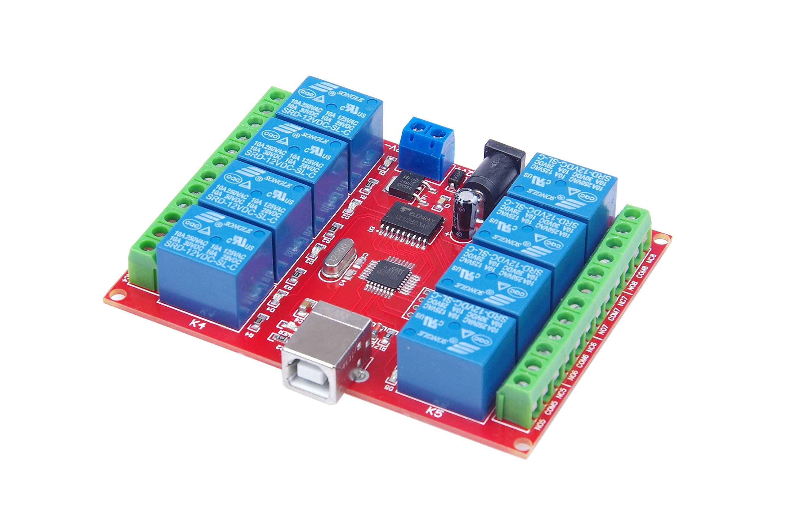

# Control USB Relay modules
Control USB Relay modules with Node JS and React easily and simple!

## Features
- Easy and flexible in use
- User authentication
- You can add, modify or delete relays

## Install
> npm install
> cd config
> node generateKeypair.js
> npm run-script start-prod

## License
[MIT](LICENSE)